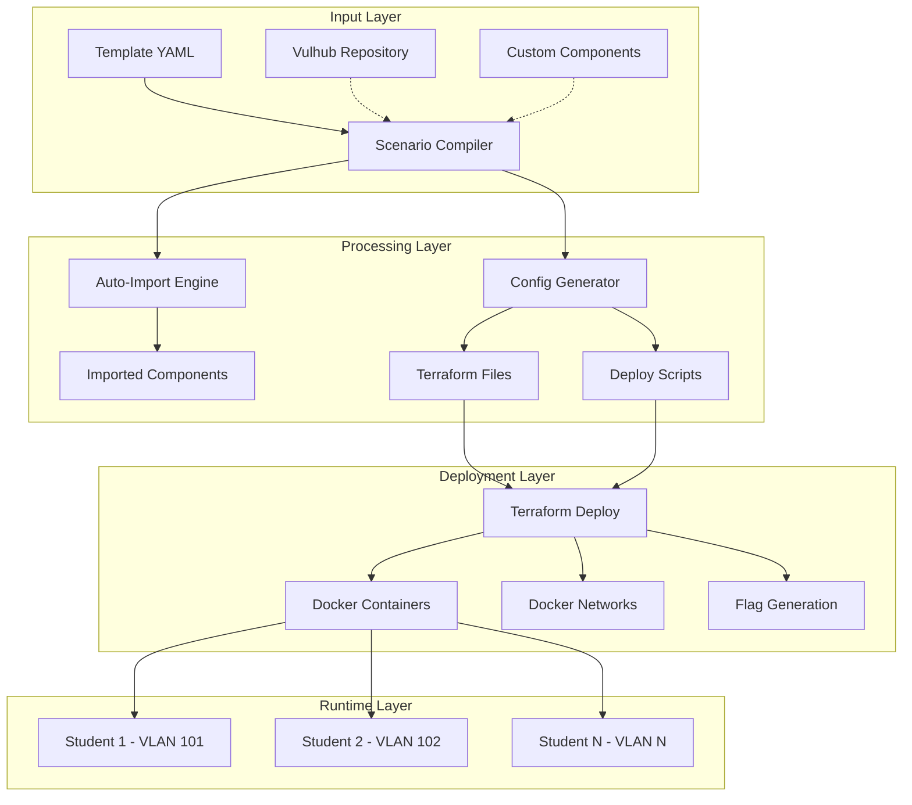
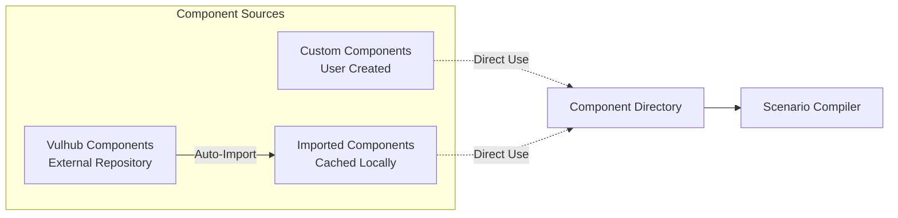
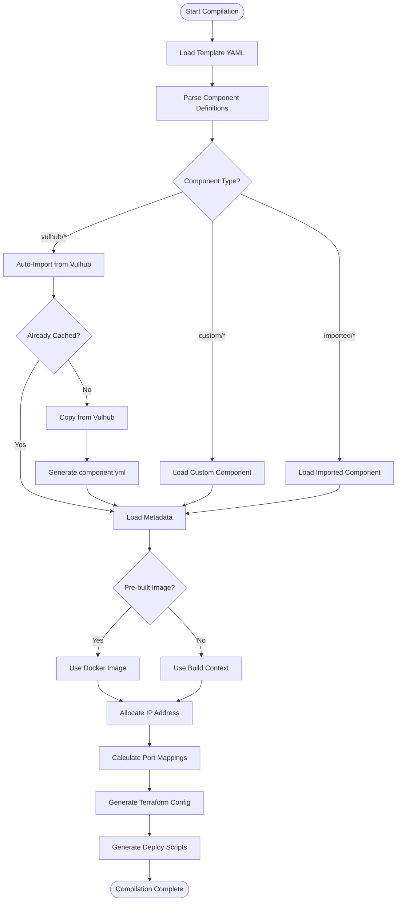
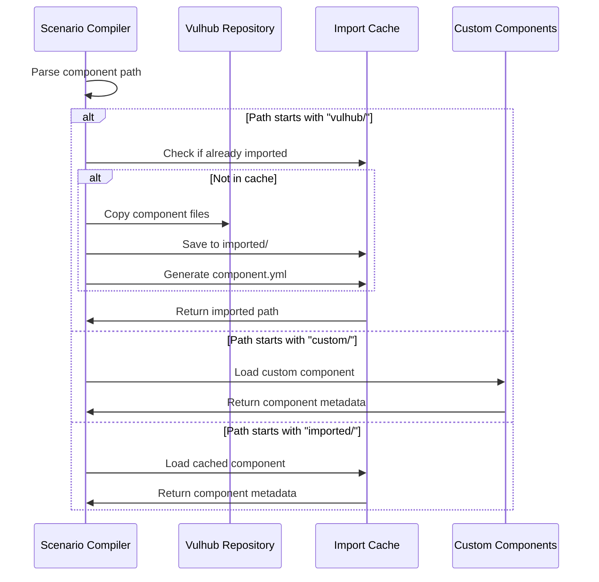
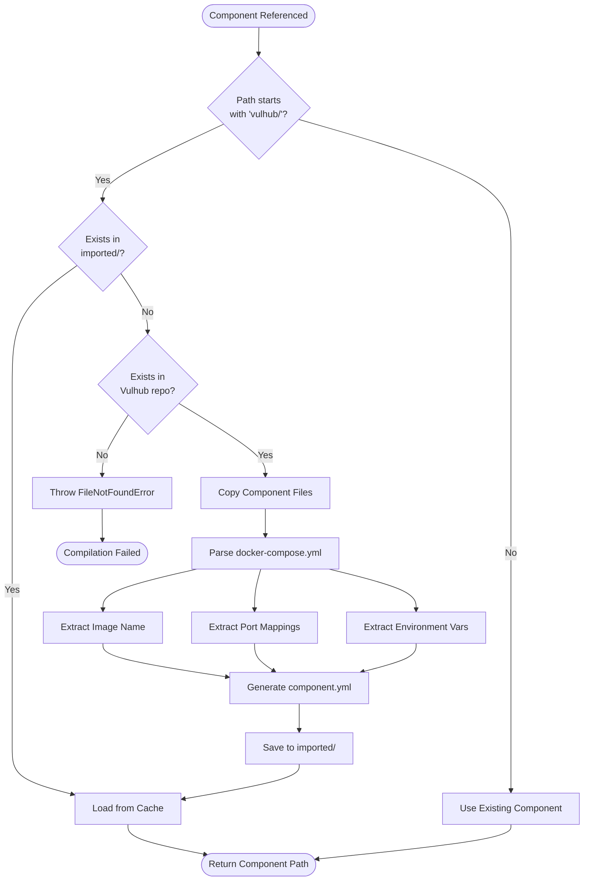
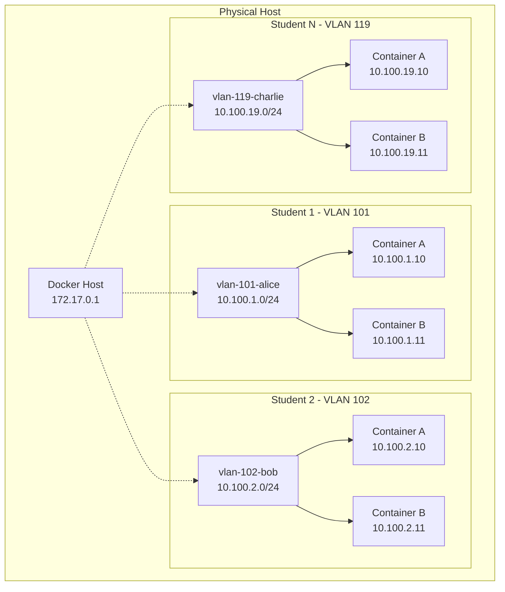
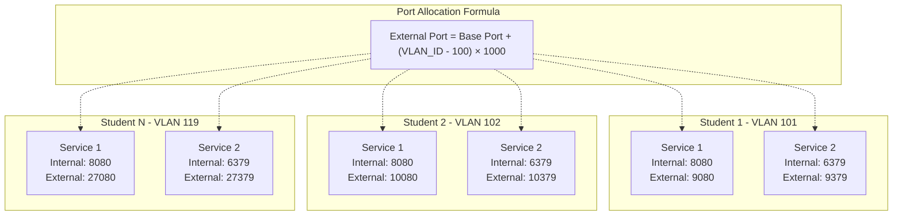
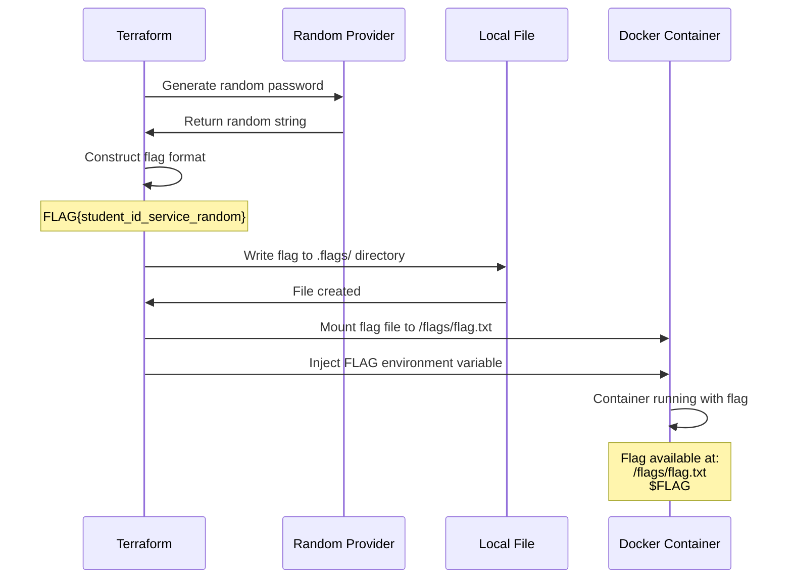

## Cyber Range

A comprehensive, scalable cyber range platform for security training and CTF competitions. This system enables automated deployment of isolated, vulnerable environments for students to practice penetration testing and exploitation techniques.

## Table of Contents

- [Overview](#overview)
- [Architecture](#architecture)
- [Scenario Generation System](#scenario-generation-system)
  - [Component Architecture](#component-architecture)
  - [Compilation Process](#compilation-process)
  - [Auto-Import System](#auto-import-system)
  - [Network Isolation](#network-isolation)
  - [Port Allocation](#port-allocation)
  - [Flag Management](#flag-management)
- [Quick Start](#quick-start)
- [Advanced Usage](#advanced-usage)
- [Directory Structure](#directory-structure)

## Overview

The Cyber Range Infrastructure provides automated scenario generation and deployment capabilities for cybersecurity training environments. It features:

- Automated component importing from Vulhub vulnerability repository
- VLAN-based network isolation for multi-student environments
- Dynamic port allocation to prevent conflicts
- Automated flag generation and injection
- Terraform-based infrastructure as code
- Docker containerization for consistent deployments

## Architecture



## Scenario Generation System

The scenario generation system is the core component responsible for transforming high-level scenario templates into fully deployable infrastructure configurations.

### Component Architecture

Components are reusable building blocks that represent vulnerable applications, services, or infrastructure elements. The system supports three types of components:



#### Component Types

**1. Vulhub Components**
- Referenced by path: `vulhub/application/vulnerability`
- Automatically imported on first use
- Cached locally for subsequent compilations
- Example: `vulhub/struts2/s2-045`

**2. Custom Components**
- User-created vulnerable applications
- Stored in `scenarios/components/custom/`
- Include custom Dockerfiles and configurations
- Example: `custom/corporate-webapp`

**3. Imported Components**
- Vulhub components cached locally
- Stored in `scenarios/components/imported/`
- Include component metadata in `component.yml`
- Example: `imported/s2-045`

#### Component Structure

Each component contains:

```
component-name/
├── component.yml           # Metadata and configuration
├── docker-compose.yml      # Docker service definition
├── Dockerfile              # (Optional) Custom build instructions
├── README.md              # Documentation
└── [application files]    # Source code, configs, etc.
```

**component.yml Structure:**

```yaml
name: "Component Display Name"
type: "web-frontend|database|network-service"
category: "vulnerability|infrastructure"
difficulty: "easy|medium|hard"
description: "Brief description of the component"
tags:
  - vulhub
  - struts2
  - rce
docker:
  image_name: "component-identifier"
  ports:
    - "8080:8080"
  environment:
    KEY: "value"
source:
  type: "vulhub|custom"
  path: "struts2/s2-045"
```

### Compilation Process

The scenario compiler transforms templates into deployable infrastructure through a multi-stage pipeline:



#### Stage 1: Template Parsing

The compiler reads the scenario template and extracts component definitions:

**Input Template:**
```yaml
name: "Web Application Exploitation"
description: "Multi-stage attack scenario"

components:
  web: vulhub/struts2/s2-045
  cache: vulhub/redis/CVE-2022-0543
  db: custom/vulnerable-mysql
```

**Output:** Component list with metadata and paths

#### Stage 2: Component Resolution

For each component, the system determines its source and resolves its path:



#### Stage 3: Configuration Generation

The compiler generates Terraform configurations, variable files, and deployment scripts:

**Generated Files:**

1. **main.tf** - Core Terraform configuration
   - Provider definitions
   - Resource declarations
   - Network configuration
   - Container definitions

2. **components.auto.tfvars** - Component variables
   - Image references
   - Build contexts
   - IP allocations
   - Port mappings

3. **deploy.sh** - Deployment automation script
4. **cleanup.sh** - Cleanup automation script

### Auto-Import System

The auto-import system automatically fetches and caches Vulhub components on first use:



**Import Process Details:**

1. **Detection Phase**
   - Compiler encounters `vulhub/application/vulnerability` reference
   - Checks `scenarios/components/imported/vulnerability/` for existing cache

2. **Validation Phase**
   - Verifies source exists in `external/vulhub/application/vulnerability/`
   - Validates directory structure and required files

3. **Copy Phase**
   - Recursively copies all files from Vulhub to import cache
   - Preserves directory structure and file permissions

4. **Metadata Generation Phase**
   - Parses `docker-compose.yml` to extract configuration
   - Detects pre-built Docker images or build contexts
   - Extracts port mappings and environment variables
   - Generates standardized `component.yml`

5. **Caching Phase**
   - Saves to `scenarios/components/imported/`
   - Subsequent compilations use cached version
   - No re-import unless cache is cleared

**Example Import:**

```bash
# First compilation
$ python3 tools/scenario-compiler.py web-exploit.yml
Compiling: Web Application Exploitation
Resolving components...
  s2-045: importing from Vulhub...
  s2-045: imported successfully

# Second compilation (same component)
$ python3 tools/scenario-compiler.py another-scenario.yml
Compiling: Another Scenario
Resolving components...
  s2-045: already imported
```

### Network Isolation

Each student deployment receives an isolated VLAN with dedicated IP address space:



**Network Configuration Formula:**

```
Subnet: 10.100.{VLAN_ID - 100}.0/24
Gateway: 10.100.{VLAN_ID - 100}.1
Container IPs: 10.100.{VLAN_ID - 100}.{10 + service_index}
```

**Examples:**

| VLAN ID | Subnet         | Gateway      | Container IPs         |
|---------|----------------|--------------|----------------------|
| 101     | 10.100.1.0/24  | 10.100.1.1   | 10.100.1.10-254      |
| 102     | 10.100.2.0/24  | 10.100.2.1   | 10.100.2.10-254      |
| 119     | 10.100.19.0/24 | 10.100.19.1  | 10.100.19.10-254     |
| 150     | 10.100.50.0/24 | 10.100.50.1  | 10.100.50.10-254     |

**Isolation Properties:**

- Complete layer 2 isolation between VLANs
- No cross-student traffic possible
- Independent network namespaces
- Separate DNS resolution per VLAN
- Dedicated gateway per student

### Port Allocation

Dynamic port allocation prevents conflicts in multi-student deployments:



**Port Calculation:**

```
External Port = Internal Port + ((VLAN_ID - 100) × 1000)
```

**Examples:**

| Student | VLAN | Internal Port | External Port | Calculation          |
|---------|------|---------------|---------------|----------------------|
| Alice   | 101  | 8080          | 9080          | 8080 + (1 × 1000)    |
| Bob     | 102  | 8080          | 10080         | 8080 + (2 × 1000)    |
| Charlie | 119  | 8080          | 27080         | 8080 + (19 × 1000)   |
| Alice   | 101  | 6379          | 9379          | 6379 + (1 × 1000)    |
| Bob     | 102  | 6379          | 10379         | 6379 + (2 × 1000)    |

**Benefits:**

- Predictable port allocation
- No manual port management required
- Supports up to 155 concurrent students (VLAN 101-255)
- Easy firewall rule configuration
- Simple access URL construction

**Access Pattern:**

```bash
# Student on VLAN 101
http://host:9080/   # Service 1
http://host:9379/   # Service 2

# Student on VLAN 102
http://host:10080/  # Service 1
http://host:10379/  # Service 2
```

### Flag Management

Automated flag generation ensures unique challenges per student:



**Flag Format:**

```
FLAG{student_id_service_name_random_hash}
```

**Components:**
- `student_id`: Student identifier (e.g., "alice", "bob")
- `service_name`: Component identifier (e.g., "web", "db", "cache")
- `random_hash`: 16-character alphanumeric string (no special chars)

**Examples:**

```
FLAG{alice_web_a1b2c3d4e5f6g7h8}
FLAG{bob_cache_x9y8z7w6v5u4t3s2}
FLAG{charlie_db_p1q2r3s4t5u6v7w8}
```

**Flag Injection Methods:**

1. **Volume Mount** (Pre-built images)
   - Flag written to host: `.flags/alice_web_flag.txt`
   - Mounted to container: `/flags/flag.txt`
   - Read-only mount for security

2. **Environment Variable** (All containers)
   - Variable name: `FLAG`
   - Available via: `echo $FLAG` or `printenv FLAG`
   - Accessible to application code

3. **Build Argument** (Custom builds)
   - Passed during Docker build
   - Can be embedded in application
   - Baked into image layers

**Flag Storage:**

```
scenarios/deployed/scenario-name/.flags/
├── alice_web_flag.txt
├── alice_cache_flag.txt
├── bob_web_flag.txt
├── bob_cache_flag.txt
└── charlie_web_flag.txt
```

**Security Considerations:**

- Flags regenerated on each deployment
- Unique per student and service
- No flag reuse across deployments
- Files excluded from version control
- Terraform state contains flags (encrypted recommended)

**Retrieval Methods:**

```bash
# From Terraform output
terraform output -json deployment_info | jq '.value.flags'

# From host filesystem
cat .flags/alice_web_flag.txt

# From inside container
cat /flags/flag.txt
echo $FLAG
```

## Quick Start

### Prerequisites

```bash
# Install dependencies
sudo apt update
sudo apt install -y python3 python3-pip docker.io

# Install Python packages
pip3 install click pyyaml

# Install Terraform
wget https://releases.hashicorp.com/terraform/1.6.6/terraform_1.6.6_linux_amd64.zip
unzip terraform_1.6.6_linux_amd64.zip
sudo mv terraform /usr/local/bin/
```

### Initial Setup

```bash
# Clone repository
git clone <repository-url>
cd Scenario-Gen

# Setup Vulhub dependency
./tools/setup-vulhub.sh

# Verify installation
python3 tools/scenario-compiler.py --help
terraform --version
```

### Creating Your First Scenario

**Step 1: Create Template**

```bash
cat > scenarios/templates/my-first-scenario.yml << 'EOF'
name: "Web Application Exploitation"
description: "Practice exploiting Struts2 vulnerability"

components:
  webapp: vulhub/struts2/s2-045
EOF
```

**Step 2: Compile Scenario**

```bash
python3 tools/scenario-compiler.py my-first-scenario.yml
```

**Output:**
```
Compiling: Web Application Exploitation
Scenario: my-first-scenario

Resolving components...
  s2-045: importing from Vulhub...
  s2-045: imported successfully

Building deployment configuration...
  webapp: using image vulhub/struts2:2.3.30
    IP: 10.100.{VLAN_ID-100}.10

Compilation complete!
Output: scenarios/deployed/my-first-scenario
```

**Step 3: Deploy for Student**

```bash
cd scenarios/deployed/my-first-scenario

# Initialize Terraform
terraform init

# Deploy for student "alice" on VLAN 101
./deploy.sh alice 101
```

**Step 4: Access and Test**

```bash
# Student accesses application
curl http://localhost:9080/

# Exploit using provided tools
python3 ../../tools/exploit.py http://localhost:9080/ "cat /flags/flag.txt"
```

## Advanced Usage

### Multi-Component Scenarios

```yaml
name: "Corporate Network Breach"
description: "Multi-stage attack simulation"

components:
  dmz-web: vulhub/struts2/s2-045
  internal-cache: vulhub/redis/CVE-2022-0543
  database: vulhub/mysql/CVE-2012-2122
  app-server: custom/corporate-api
```

### Deployment for Multiple Students

```bash
# Deploy for multiple students
./tools/deploy-all-students.sh my-scenario alice:101 bob:102 charlie:103

# Check deployment status
./tools/check-deployments.sh my-scenario

# Cleanup all deployments
./tools/cleanup-all.sh my-scenario
```

### Custom Component Creation

```bash
# Create component directory
mkdir -p scenarios/components/custom/my-app

# Create Dockerfile
cat > scenarios/components/custom/my-app/Dockerfile << 'EOF'
FROM ubuntu:20.04
RUN apt-get update && apt-get install -y nginx
COPY index.html /var/www/html/
EXPOSE 80
CMD ["nginx", "-g", "daemon off;"]
EOF

# Create component.yml
cat > scenarios/components/custom/my-app/component.yml << 'EOF'
name: "My Custom Application"
type: "web-frontend"
category: "vulnerability"
difficulty: "easy"
description: "Custom vulnerable web application"
docker:
  image_name: "my-app"
  ports:
    - "80:80"
EOF

# Use in template
cat > scenarios/templates/custom-test.yml << 'EOF'
name: "Custom Component Test"
components:
  myapp: custom/my-app
EOF
```

## Directory Structure

```
Scenario-Gen/
├── external/
│   └── vulhub/                     # Vulhub repository (not tracked)
├── scenarios/
│   ├── components/
│   │   ├── custom/                 # User-created components
│   │   │   └── component-name/
│   │   │       ├── component.yml
│   │   │       ├── Dockerfile
│   │   │       └── [files]
│   │   └── imported/               # Auto-imported from Vulhub
│   │       └── component-name/
│   │           ├── component.yml
│   │           ├── docker-compose.yml
│   │           └── [files]
│   ├── templates/                  # Scenario definitions
│   │   ├── scenario1.yml
│   │   └── scenario2.yml
│   └── deployed/                   # Compiled scenarios
│       └── scenario-name/
│           ├── main.tf
│           ├── components.auto.tfvars
│           ├── deploy.sh
│           ├── cleanup.sh
│           └── .flags/
├── terraform/
│   └── shared-deployment/          # Shared Terraform modules
│       ├── versions.tf
│       └── providers.tf
└── tools/
    ├── scenario-compiler.py        # Main compiler
    ├── exploit.py                  # S2-045 exploit tool
    ├── setup-vulhub.sh            # Vulhub setup script
    ├── deploy-all-students.sh     # Bulk deployment
    ├── check-deployments.sh       # Status checker
    └── cleanup-all.sh             # Bulk cleanup
```

---

**Note:** Additional documentation for deployment management, student access, monitoring, and administrative tasks will be added in future updates.
```
 Cyber-Range-TU
